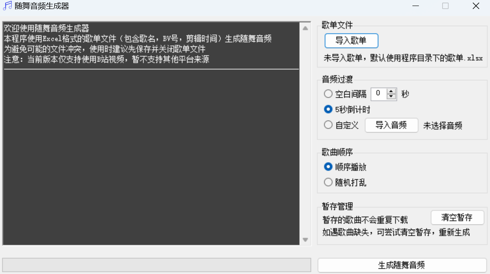

# 随舞音频生成器

该工具使用Excel格式的歌单。填写歌名、视频BV号、剪辑时间，即可生成音频文件。注意：当前仅支持使用B站视频作为音频源。

歌单格式示例如下：

曲名	|视频 BV号	|剪辑时间（未填写时默认全曲）
:--|:--|:--
与你同行B with U	|BV16W411s7Gz	|0:00-0:33
彩虹节拍	|BV127411q7zn	|0:31-1:46
此刻memories	|BV1dD421A7sY	|2:43-3:32
这么可爱真是抱歉	|BV1iy4y1Z7Ri	|全曲

---

## 下载链接

https://github.com/LightningMaker/RandomPlayDance-Generator/releases

---

## 注意

注意：win7 / win8 系统需要手动下载 [.NET Framework 4.7.2运行环境](https://dotnet.microsoft.com/zh-cn/download/dotnet-framework/net472)。win10 / win11可以直接运行。

---

## 致谢

[bilibili-API-collect](https://github.com/SocialSisterYi/bilibili-API-collect)

[FFMpeg](https://ffmpeg.org/)

[FFMpegCore](https://github.com/rosenbjerg/FFMpegCore)

[npoi](https://github.com/nissl-lab/npoi)

[Newtonsoft.Json](https://github.com/JamesNK/Newtonsoft.Json)

